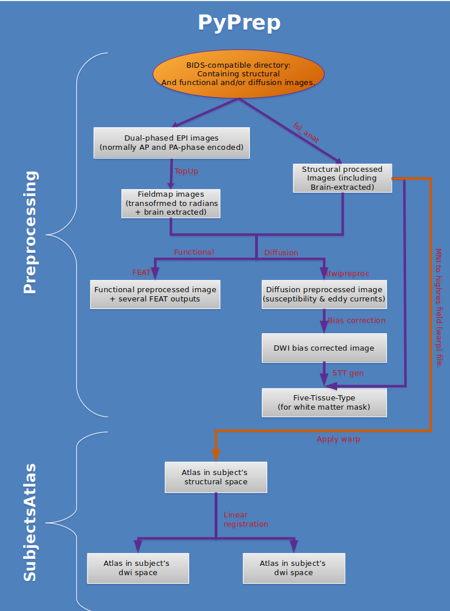

# PyPrep
## Yaniv Assaf's lab automated preprocessing project.
 
### Prepocessing pipeline:
Diffusion (DWI) preprocessing procedure:

1. Generate fieldmap files for eddy current correction:
    A. Merge both phase-encoded images into one. (FSL's Merge)
    B. Create acuisition parameters file, relying on the dual-phase encoded image.
    C. Create index file (a file contining n-rows of 1 for each scan of the image to be preprocessed.)
    D. Apply TopUp to remove suceptabillity bias.
    E. Create fieldmap magnitude brain image and transform fieldmap into radians (for compatibillity with later used tools.)
    (for more details regarding the acusition and usage of fieldmaps, [see this artical][https://lcni.uoregon.edu/kb-articles/kb-0003])
2. Generate bias-corrected, brain-extracted structural image, as well as MNI-to-subject space field (warp) file, and several other intermediate files (for further detail, see [FSL's fsl_anat documentation](https://fsl.fmrib.ox.ac.uk/fsl/fslwiki/fsl_anat)).
3. For functional images, run FSL's FEAT using the functional, brain-extracted structural,brain extracted fieldmap magnitude and fieldmap (in radians) images (for further details, see [FSL's FEAT documentation](https://fsl.fmrib.ox.ac.uk/fsl/fslwiki/FEAT)).
4. For diffusion images, apply eddy-currents correction using the DWI, brain mask, index file, acuisition parameters file, bvec, bval, and field coefficients and movpar files from TopUp procedure. (for futher details, see [Mrtrix3's dwipreproc documentation](https://mrtrix.readthedocs.io/en/latest/reference/scripts/dwipreproc.html))

# Preprocessing module:
Perform a complete preprocessing pipeline on a BIDS-compatible directory.

## Class BidsPrep
Contains several functions aimed at applying preprocessing-relevant method on MRI images found on a BIDS-compatible directory.

> Initiate the BIDS preprocessing class with either a specific subject or None = all subjects (default)
* Arguments:
    * mother_dir {Path} -- [Path to a BIDS compliant directory (should contain "mother_dir/sub-xx")]
    * bids_dir {str} -- Path to the directory to initialize as a BIDS compliant one.

* Keyword Arguments:
    * subj {str} -- ["sub-xx" for specific subject or None for all subjects] (default: {None})
    * out_dir {Path} -- [Output directory. Default is "derivatives" at the same directory level as {mother_dir}] (default: {"derivatives" directory in the same level as {mother_dir}})
    * design {Path} -- [Path to FEAT's design template.] (default: {'/templates/design.fsf'})
    * skip_bids {bool} -- [wether to skip the BIDS-compatibility section. Note that incompatibilities with BIDS structure may result in errors during the run.] (default: {False})

### Usage:
```
>>> from PyPrep.code import Preprocessing

>>> prep = Preprocessing.BidsPrep(
        mother_dir = Path('/path/to/your/bids_dir'),
        subj = 'sub-01',
        out_dir = Path('/path/to/your/output_dir'),
        design = Path('/path/to/your/feat_design.fsf'),
        skip_bids = False)
```
* Note that the {mother_dir} directory must contain subdirectories with names such as "sub-XX"
```
>>> prep.run()
```
### Output:
* derivatives/
    * sub-01/
        * dwi/
            * Mrtrix_prep
                * intermediate files
            * DWI preprocessed files ("*_biascorr.nii.gz" being the final output)
        * fmap/
            * Fieldmap files
        * anat/
            * prep.anat/
                * {Subject's processed structural images}
        * scripts/
            * Subject's scripts for FEAT
        * atlases/
            * {Empty, meant for further atlas registration to subject's space}
        * func/
            * func.feat/
                * {FEAT output files}
                * reg/
                    * {FEAT registration files}
                * mc/
                    * Motion correction output files
                    * prefiltered_func_data_mcf.mat/
    * sub-02/
        * dwi/
        * fmap/
        * anat/
        * scripts/
        * atlases/
        * func/
    * .
    * .
    * .

# SubjectsAtlas module:
Use the preprocessing output to register an atlas to subject's space.

## Class SubjectsAtlas:
Contains several functions aimed at manipulating an atlas image (in MNI space) into subject's structural, dwi and functional space.

> Initiate the SubjectsAtlas class with either a specific subject or None = all subjects (default)

* Arguments:
    * derivatives_dir {Path} -- [Path to derivatives directory (preprocessed using PyPrep.code.Preprocessing)]

* Keyword Arguments:
    * atlas {Path} -- [Path to atlas' directory (must contain highres and labels files)] (default: {megaatlas})
    * subj {str} -- ["sub-xx" for specific subject or None for all subjects] (default: {None (i.e all subjects)})
    * out_dir {Path} -- [Output directory] (default: {"{derivatives_dir}/sub-xx/atlases"})

### Usage:
```
>>> from PyPrep.code import SubjectsAtlas

>>> atlas = SubjectsAtlas.SubjectsAtlas(
        derivatives_dir = Path('/path/to/your/derivatives_dir'),
        atlas = Path('./PyPrep/atlases/megaatlas')
        subj = 'sub-01',
        out_dir = Path('{derivatives_dir}/sub-01/atlases'))
```
* Note that the {derivatives_dir} directory must contain the results of PyPrep.code.Preprocessing's pipeline.
```
>>> atlas.run()
```
### Output:
* derivatives/
    * sub-01/
        * dwi/
        * fmap/
        * anat/
        * scripts/
        * atlases/
            * highres_atlas2highres.nii.gz  ---> in subject's structural space
            * labels_atlas2highres.nii.gz
            * highres_atlas2dwi.nii.gz  ---> in subject's dwi space
            * labels_atlas2dwi.nii.gz
            * highres_atlas2func.nii.gz  ---> in subject's functional space
            * labels_atlas2func.nii.gz
        * func/
    * sub-02/
    * .
    * .
    * .

